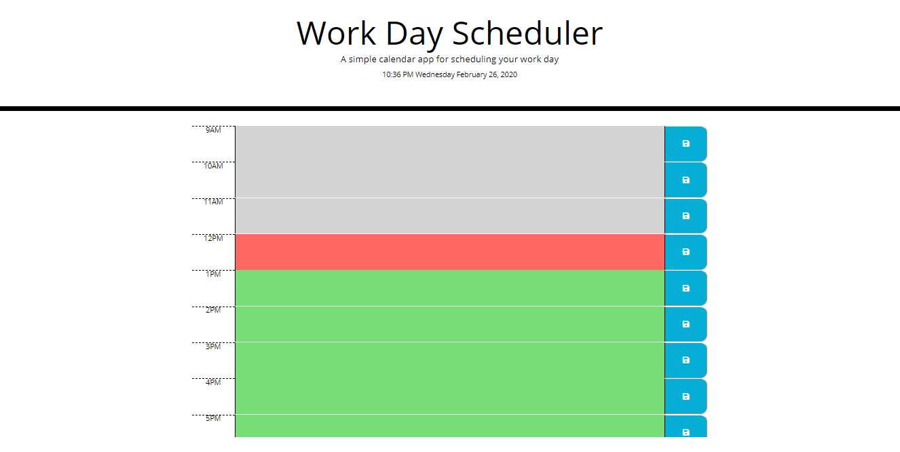

# Scheduler

In this assignment I created a functional calendar that allows the user to save any information typed inside the columns. The Scheduler keeps track of the day, month and time. 

[Website](https://jerry-seinfeld.github.io/Scheduler/)

